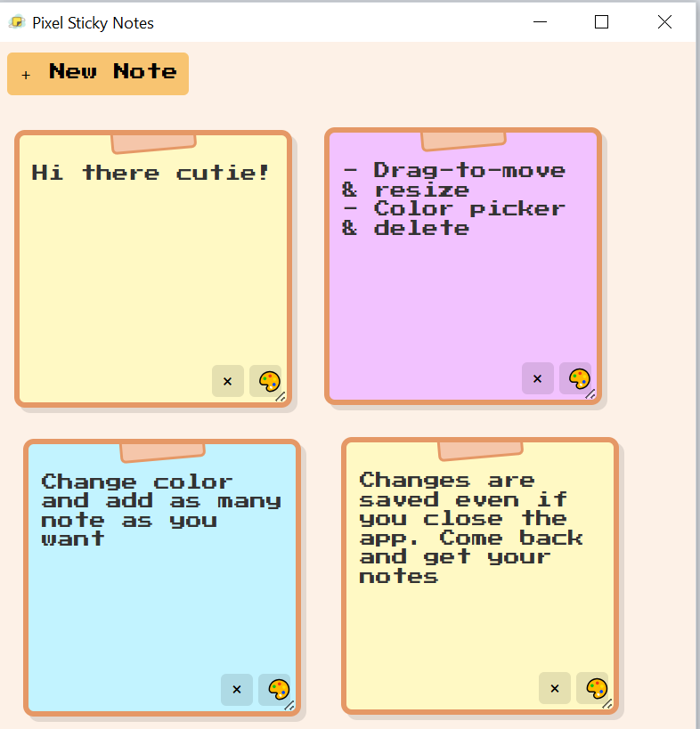

# Pixel Sticky Notes

A cute pixel-style multi-note manager wrapped in an Electron desktop app.



## Features

- 🎀 Create, move, resize and delete individual sticky notes  
- 🎨 Pick each note’s pastel background via a native color-picker  
- 🆕 Add new notes with one click  
- 🖱️ Click & drag to reposition; active note always comes to front  
- 🔄 Auto-save in `localStorage` so your notes persist on reload  
- 📋 Tray icon with “Show Notes” & “Quit”, plus start-on-login on Windows  

## Download

A ready-made portable ZIP is available on Google Drive:

[Download PixelStickyNotes (ZIP)](https://drive.google.com/file/d/1t6sTxoYXvgrlKd2R3JbJuHLo873bNjfi/view?usp=drive_link)

Unzip and double‐click `PixelStickyNotes.exe` to run.


## Development

1. Clone this repo
```
git clone https://github.com/YourUsername/pixel-sticky-notes.git
cd pixel-sticky-notes
```

2. Install dependencies
```
npm install
```

3. Run in development mode
```
npm start
```
# Build the Windows installer (NSIS)
```
npm run dist
```
After the build completes you’ll find:

dist/

├─ win-unpacked/                     # portable folder

└─ PixelStickyNotes Setup 1.0.0.exe  # Windows installer

# Project Structure

pixel-sticky-notes/

├── main.js         # Electron main process

├── preload.js      # (empty) preload script

├── index.html      # UI

├── style.css       # styles

├── script.js       # renderer logic (notes & color-picker)

├── tray-icon.ico   # app & installer icon (256×256)

├── pixy.png        # demo screenshot

├── package.json

├── package-lock.json

└── README.md


Happy note-taking! 🎉
Feel free to open an issue or send a pull request on GitHub.
